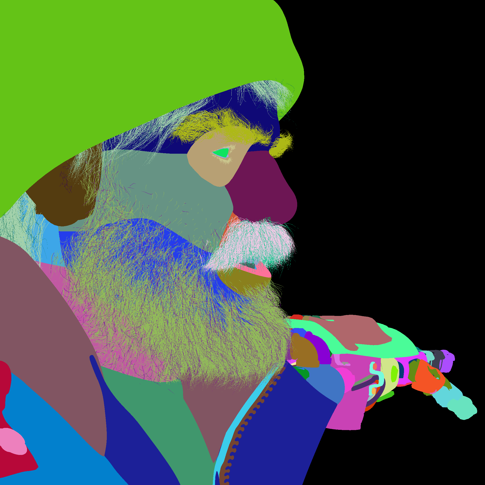

# 3D Scene Segmentation

This repository contains a suite of Python scripts designed for segmenting 3D scenes using Blender's Python API. The scripts automate the process of applying semantic and sub-segmentation to 3D objects in Blender, facilitating the generation of segmented 3D models for various applications such as machine learning and visualization.

# Longer explanation:

The quality of deep learning models is intimately tied to the data they are trained on, with classified images being particularly crucial. By classifying each pixel directly, this project significantly enhances image understanding and precision. Each pixel is meticulously labeled with a string that defines its role, deepening our understanding of the image's content and the relationships among its elements. This detailed labeling supports both comprehensive scene semantic segmentation and more nuanced sub-segmentation at the object feature level.

The output of this system includes a JSON file that maps colors to string descriptors and a segmented blender scene that adheres strictly to these mappings, ensuring consistency across applications. For example, the term "eye" consistently appears in the same color, which helps in forming a "second language" that aids developers in debugging and understanding diverse images. Moreover, this pixel-level classification approach can be seamlessly integrated with image super augmentation techniques, enhancing the robustness and versatility of the training data used for machine learning models.

Advantages of this system include:

Consistent color mappings that facilitate recognition and analysis across different applications.
Quick processing suitable for complex 3D scenes.
Efficient generation of outputs like semantic segmentation, sub-segmentation, and instance segmentation images.
Requires minimal images to describe and segment a rendered 3D scene comprehensively.
Works independently of specific rendering engines by integrating directly at the 3D model level.
Provides a simple and comprehensive solution for most segmentation needs.

Disadvantages include:

Challenges with sub-pixel variations, potentially missing finer details.
Lack of support for blurring and other focus effects, which might limit the segmentation accuracy.

For scenarios that demand precise control over gradients or object edges, Cryptomatte is recommended to generate detailed masks efficiently. This segmentation system caters to approximately 90% of the needs in 3D scene analysis, making it a powerful tool for developers working with visual data and machine learning applications.


## Example Output
<p align="center">
  
  
</p>

<p align="center">
  
  
</p>

## Table of Contents
- [Features](#features)
- [Future Features](#future-features)
- [Installation](#installation)
    - [Prerequisites](#prerequisites)
    - [Configure Development Environment](#configure-development-environment)
    - [Run the Scripts](#run-the-scripts)
- [Scripts Overview](#scripts-overview)
- [Contributing](#contributing)
- [License](#license)
- [Acknowledgements](#acknowledgements)

## Features
- **Semantic Segmentation**: Assigns unique colors to different objects in a 3D scene based on their type or other attributes.
- **Sub-Segmentation**: Applies detailed segmentation within individual objects based on predefined vertex group prefixes.
- **Color Consistency**: Utilizes a hashing mechanism to ensure consistent color assignment across different sessions.
- **High Color Depth**: Supports 8-bit to 32-bit per channel color depth for segmentation space control.
- **Automated Material Application**: Automatically applies materials and shaders to segmented parts.
- **Material Usage Optimiztion**: The number of materials needed for segmentation is minimal and usually ends up with only two.
- **Automatic Object Detection and Classification**: Integration of AI-based detectors to automatically identify and classify objects in 3D scenes.

## Future Features
Planned enhancements to extend functionality and improve user experience include:
- **Instance Segmentation**: Implementation of instance segmentation to distinguish individual instances of the same object type within a scene.
- **Support for AOV in Rendering**: Adding Arbitrary Output Variable (AOV) support to enhance rendering capabilities, allowing output multi segmentation types in a single render.
- **Automation for Cryptomatte**: Developing automated processes for Cryptomatte in Blender for cases where the current system is limited, enhancing the ability to handle complex masking and object isolation.
- **Refraction Support in Segmentation**: Adding support for realistic refraction in transparent materials such as glass.

## Installation
### Prerequisites
1. **Download and Install Blender Portable**:
    - Download Blender 4.2 Portable from the official Blender website. Extract it to `C:\\blender` on Windows.

2. **Clone the Repository**:
    - Clone this repository to your local machine using Git:
        ```bash
        git clone https://github.com/yourUsername/3d_scene_segmentation.git
        ```
    - Navigate to the directory where you cloned the repo.

3. **Setup Startup Script**:
    - Create a `startup.py` file in `C:\blender\4.2\scripts\startup`. Inside the `startup.py` file, add the following lines:
      ```
        import sys
        
        repo_path ="repo path " 
        
        def register():
            # Add the repository path to sys.path when Blender starts
            if repo_path not in sys.path:
                sys.path.append(repo_path)
                print(f"Added {repo_path} to Python path")
        
        def unregister():
            # This function can remain empty if you have nothing to unregister
            # Optionally, you could remove the repo path from sys.path when Blender exits
            if repo_path in sys.path:
                sys.path.remove(repo_path)
                print(f"Removed {repo_path} from Python path")
        
        if __name__ == "__main__":
            register()
        ```

### Configure Development Environment
1. **Setting Up Visual Studio Code**:
    - Install Visual Studio Code.
    - Install the Python extension for Visual Studio Code.
    - Install the `fake-bpy-module` for autocomplete features:
        ```bash
        pip install fake-bpy-module-latest
        ```
    - Configure Visual Studio Code to use the Python interpreter that comes with Blender, usually located in your Blender directory.

### Run the Scripts
- Run the test script using blender executable with python flag:
```
<path-to-blender-executable> --python <path-to-script>
```
- (it will look something like that) 
```
c:\blender\blender.exe --python D:\temp\scene_segmentation\tests\segmentation_test.py
```
## Scripts Overview
- **constants.py**: Defines constants used across the segmentation processes.
- **logger_config.py**: Configures logging for tracking the script operations.
- **render_settings.py**: Sets up rendering settings optimized for segmentation.
- **utils.py**: Provides utility functions for object and material management.
- **segmentation_test.py**: Main script that orchestrates the loading, processing, and saving of segmented 3D models.
- **seg_materials.py**: Manages creation and application of materials for segmentation.
- **seg_utils.py**: Contains utility functions specifically for segmentation tasks.

## Credits for example Blender file
- **Blender 3.5 – Cozy Kitchen** by Nicole Morena
- **Blender Studio 
- **Christophe Seux


## Contributing
Contributions to improve the functionality or efficiency of the segmentation processes are welcome. To contribute:
1. Fork the repository.
2. Create a new branch for each significant change.
3. Commit your changes.
4. Push to your fork and submit a pull request.

## License
This project is open source and available under the MIT License.

## Acknowledgements
Thanks to all contributors who have helped in refining these scripts and the community for the continuous feedback and support.
